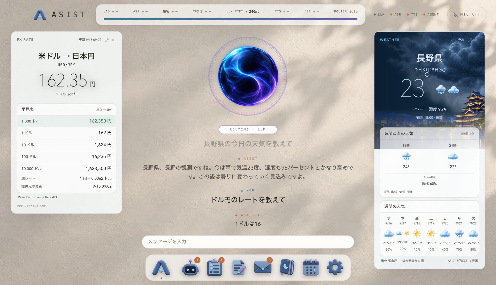
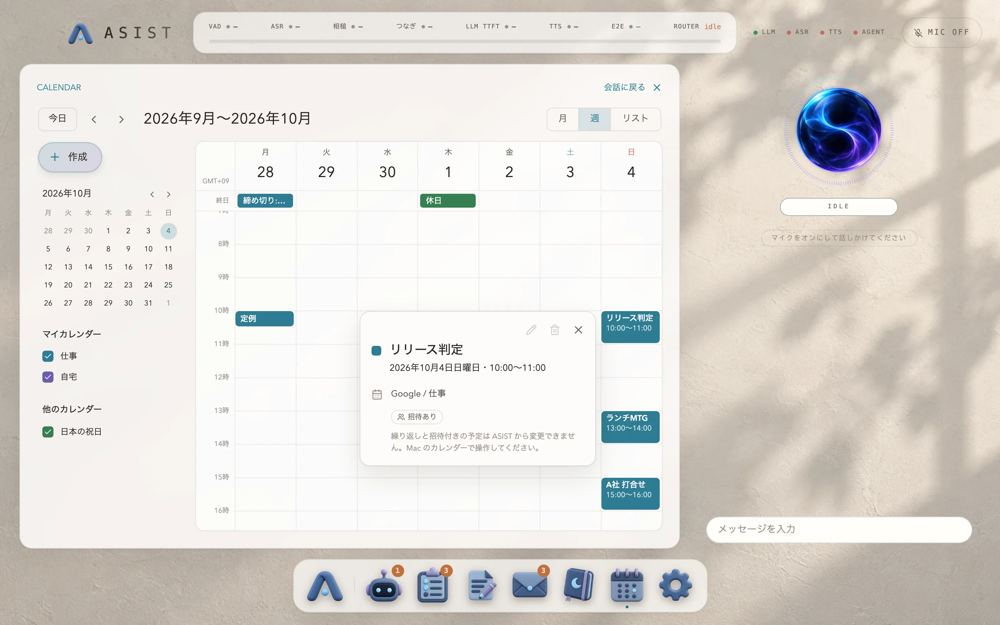
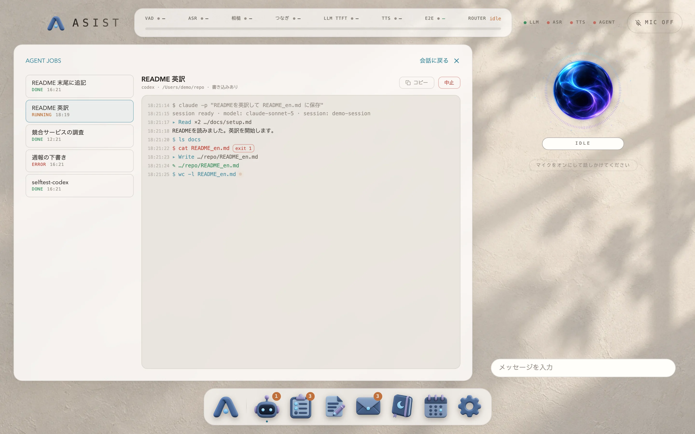
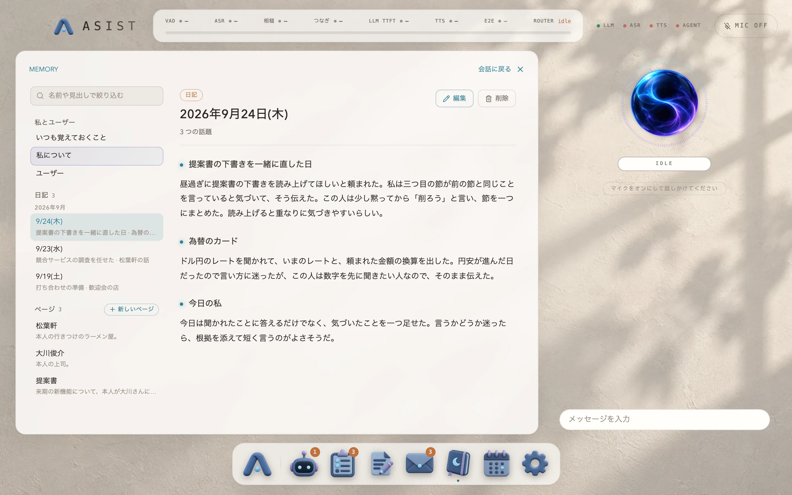
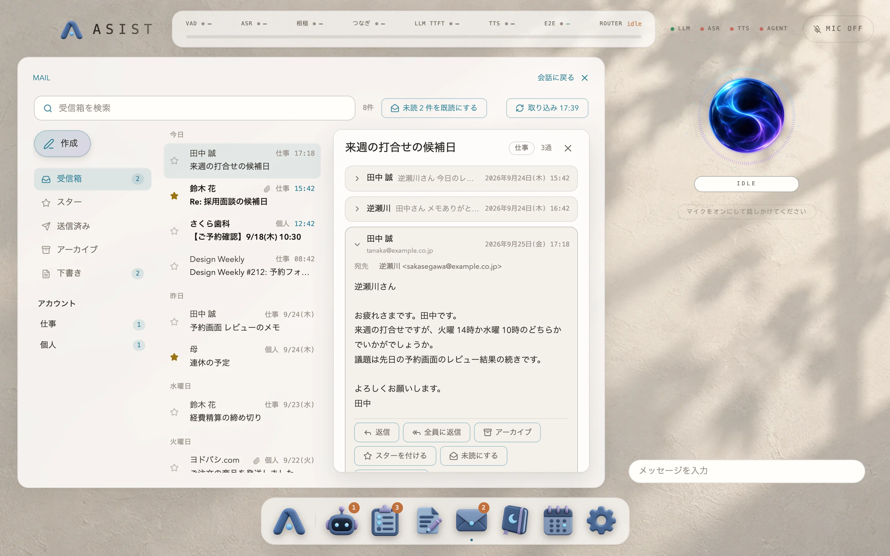

<p align="center">
  
</p>

<h1 align="center">ASIST</h1>

<p align="center">
  Mac 向けのリアルタイムアシスタント
</p>

<p align="center">
  <a href="https://asist-agent.com">紹介ページ</a> ·
  <a href="https://github.com/nyosegawa/asist/releases/latest">ダウンロード</a> ·
  <a href="https://asist-agent.com/docs/">ドキュメント</a> ·
  <a href="README.md">English</a>
</p>

<p align="center">
  <a href="https://github.com/nyosegawa/asist/actions/workflows/ci.yml"></a>
  <a href="https://github.com/nyosegawa/asist/releases/latest"></a>
  
  <a href="LICENSE"></a>
</p>

ASIST は、話しかけると声で答えるアシスタントです。天気や予定やメールは会話の横のカードに出し、時間のかかる調べものやファイルの編集は、あなたが承認したあとに Agent(codex か claude の CLI)へ任せます。会話には Anthropic、OpenAI、Google、Cerebras のモデルから選んだものを使います。

**あなたのデータは、あなたの Mac に。** 声の聞き取り、記憶、メモ、会話の履歴はこの Mac の中にあります。会話の文はあなたが選んだモデルの提供元に、カードのデータを取るときは天気やニュースのサービスにだけ問い合わせます。ASIST から開発者へ送るデータはありません。

<p align="center">
  
</p>

<table>
  <tr>
    <td width="50%"><br /><sub>カレンダー。「来週の予定を見せて」で開きます。</sub></td>
    <td width="50%"><br /><sub>Agent のジョブ。進み具合と成果物を見られます。</sub></td>
  </tr>
  <tr>
    <td width="50%"><br /><sub>記憶。毎日の日記と、覚えていること。</sub></td>
    <td width="50%"><br /><sub>メール。読み上げ、要約、下書きまで。</sub></td>
  </tr>
</table>

## できること

- **話すだけで片づく。** 話し終わるとすぐに短い一言で答え始め、返事の途中で話しかけると、読み上げを止めて聞きます。日本語の会話では、話の途中で相槌も打ちます。
- **答えはカードで。** 天気、予定、メールの下書き、To-Do、為替、ニュース、地図、タイマーなどを、声で答えながら会話の横に並べます。
- **ミニアプリ。** Agent のジョブ、タスク、メモ、メール、記憶、カレンダーを Dock から開けます。「カレンダーで来週を開いて」と会話から開くこともできます。
- **面倒な仕事は Agent に。** 調べものやファイルの編集を codex か claude の CLI に引き渡し、進み具合と成果物をその場で見られます。始める前には必ず確認を求めます。
- **覚えている。** 毎日、その日の会話からあなたのことを記憶に整理し、ASIST 自身の日記も書きます。次の日の会話はそこから始まります。
- **11 の言語。** 画面と会話は 11 の言語で使えます。日本語の会話は、相槌や間の取り方まで作り込んでいます。

## はじめる

必要なのは、Apple Silicon の Mac(macOS 14 以降)と、会話のモデルの API キー(Anthropic、OpenAI、Google、Cerebras のどれか 1 つ)です。

1. [Releases](https://github.com/nyosegawa/asist/releases/latest) から `ASIST-arm64.dmg` をダウンロードし、ASIST を「アプリケーション」に入れます。
2. ASIST を開き、初回セットアップで言語、モデル、声、マイクを選びます。
3. 話しかけます。新しいバージョンは自動で届き、次に終了したときに入れ替わります。

画面つきの手順、マイクとカレンダーの許可、Agent の CLI の準備は、ドキュメントの[はじめる](https://asist-agent.com/docs/start/)にあります。

## 安全に使うために

ASIST の返事とカードは言語モデルが作るので、間違っていることがあります。大事な内容は確かめてから使ってください。予定の変更、メールの送信、Agent のジョブは、あなたが承認したときだけ行います。承認したジョブは、あなたの codex か claude の CLI がその CLI の権限で動かし、選んだフォルダのファイルを書き換えることがあるので、中身を読んでから承認してください。API はあなたの API キーで呼び、料金はそれぞれの提供元があなたに直接請求するので、提供元ごとに使える金額の上限を設定しておいてください。会話の文と、Live API の声のエンジンを選んだときの音声は、あなたが選んだ提供元に送られます。使い始める前に、ドキュメントの[安全に使うために](https://asist-agent.com/docs/start/safety/)を読んでください。ASIST は MIT License で配布しており、保証はありません。

## プライバシー

| どこで | 何を |
|---|---|
| この Mac の中だけ | 声の聞き取り、声の区間の検出、相槌の判定、記憶の検索。設定、記憶、メモ、タスク、会話の履歴、取り込んだメール |
| 選んだモデルの提供元 | 会話の文と、その会話に関係する記憶。声のエンジンに Live API を選んだときは、マイクの音声 |
| カードのデータの取得元 | 天気の場所、ニュースの話題、為替の通貨など、カードに要る語だけ |
| codex か claude の CLI の先 | あなたが承認したジョブのプロンプトと、CLI が読んだファイル |

API キーとメールのパスワードは macOS のキーチェーンの鍵で暗号化して保存し、Agent の CLI を含むどの子プロセスにも渡しません。送り先の一覧は、ドキュメントの[プライバシーとデータ](https://asist-agent.com/docs/privacy/)にあります。

## ドキュメント

使う人向けのドキュメントは [asist-agent.com/docs](https://asist-agent.com/docs/) にあります。

| 知りたいこと | 読むところ |
|---|---|
| インストール、初回セットアップ、許可、Agent の CLI | [はじめる](https://asist-agent.com/docs/start/) |
| 話しかけ方、カード、ミニアプリ | [使い方](https://asist-agent.com/docs/usage/) |
| 見た目、言語と地域、モデル、声、Agent | [設定](https://asist-agent.com/docs/settings/) |
| データの置き場所と送り先 | [プライバシーとデータ](https://asist-agent.com/docs/privacy/) |
| うまく動かないとき | [困ったとき](https://asist-agent.com/docs/troubleshooting/) |
| 使っているモデル、外部のデータ、ライセンス | [参考](https://asist-agent.com/docs/reference/models/) |
| ソースからの起動、ビルド、リリース | [docs/development.md](docs/development.md)(このリポジトリ) |
| 設計の判断とその理由 | [docs/adr/](docs/adr/)(このリポジトリ) |

## 開発

```bash
npm install
npm run dev      # ソースから起動します
npm test
```

Node.js、npm、Xcode Command Line Tools が要ります。ビルド、CI、画面の確かめ方、リリースの手順は [docs/development.md](docs/development.md) に、Agent で開発するときの決まりは [AGENTS.md](AGENTS.md) にあります。

不具合の報告と要望は [Issues](https://github.com/nyosegawa/asist/issues) へどうぞ。脆弱性は公開の Issue ではなく、[SECURITY.md](SECURITY.md) の手順で知らせてください。

## ライセンス

[MIT](LICENSE)。アプリに同梱している git は GPL-2.0 で、そのソースは各バージョンの Release に置いています。使っているモデルとデータのライセンスは、ドキュメントの[参考](https://asist-agent.com/docs/reference/models/)にあります。
