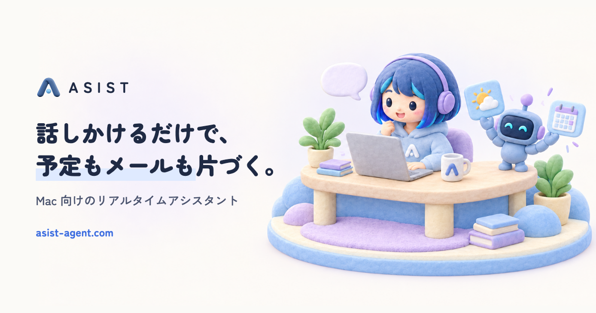
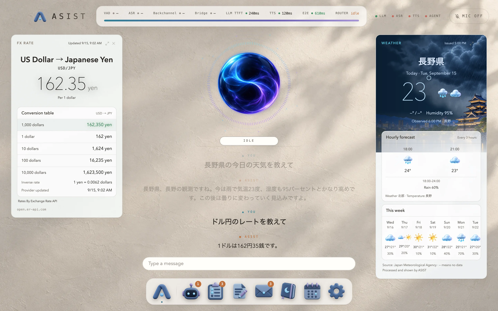
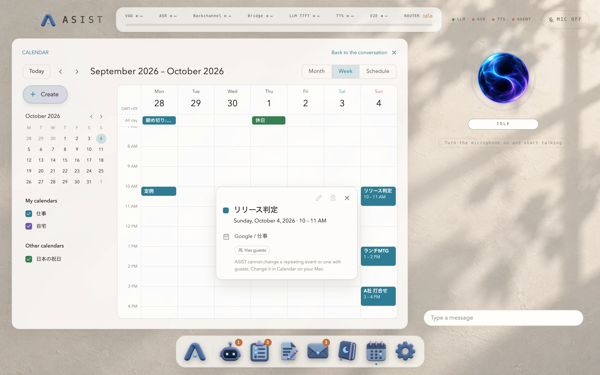
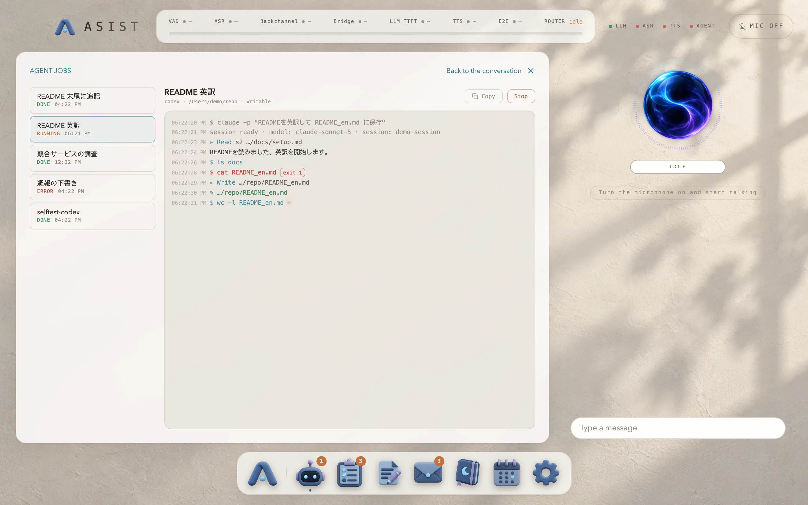
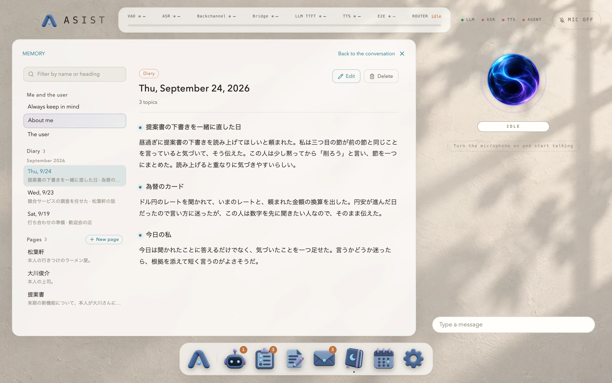
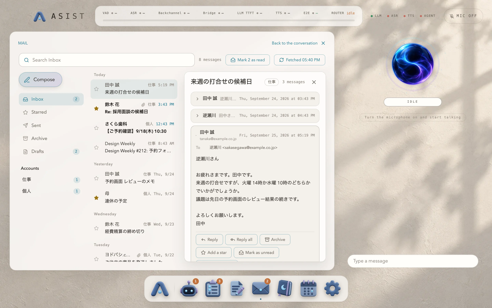

<p align="center">
  
</p>

<h1 align="center">ASIST</h1>

<p align="center">
  A realtime assistant for the Mac
</p>

<p align="center">
  <a href="https://asist-agent.com">Website</a> ·
  <a href="https://github.com/nyosegawa/asist/releases/latest">Download</a> ·
  <a href="https://asist-agent.com/en/docs/">Documentation</a> ·
  <a href="README.ja.md">日本語</a>
</p>

<p align="center">
  <a href="https://github.com/nyosegawa/asist/actions/workflows/ci.yml"></a>
  <a href="https://github.com/nyosegawa/asist/releases/latest"></a>
  
  <a href="LICENSE"></a>
</p>

ASIST is an assistant you talk to, and it answers in its own voice. Weather, events and mail appear as cards beside the conversation, and research or file edits that take time go to an agent (the codex or claude CLI) once you approve them. The conversation runs on a model you choose from Anthropic, OpenAI, Google or Cerebras.

**Your data stays on your Mac.** Listening, memory, notes and the conversation history live on this Mac. The text of the conversation goes only to the model provider you chose, and cards ask only the weather or news service they need. ASIST sends nothing to its developer.

<p align="center">
  
</p>

<table>
  <tr>
    <td width="50%"><br /><sub>Calendar. Ask “Show me next week’s schedule” to open it.</sub></td>
    <td width="50%"><br /><sub>Agent jobs. Follow the progress and open what they produce.</sub></td>
  </tr>
  <tr>
    <td width="50%"><br /><sub>Memory. A diary every day, and what it remembers.</sub></td>
    <td width="50%"><br /><sub>Mail. It reads, summarizes and drafts replies.</sub></td>
  </tr>
</table>

## What it does

- **Just talk.** It starts answering with a short phrase as soon as you finish, and stops reading aloud when you speak over it. In Japanese it also nods along with backchannels while you talk.
- **Answers as cards.** Weather, events, mail drafts, to-dos, exchange rates, news, maps, timers and more appear beside the conversation while it answers aloud.
- **Mini apps.** Agent jobs, tasks, notes, mail, memory and the calendar open from the Dock, or from the conversation: “Open next week in the calendar.”
- **Hand tedious work to an agent.** Research and file edits go to the codex or claude CLI, and you can watch the progress and open the results. It always asks before it starts.
- **It remembers.** Every day it sorts the day's conversations into its memory of you, and writes a diary of its own. The next day's conversation starts from there.
- **Eleven languages.** The interface and the conversation work in eleven languages. Japanese conversation is tuned down to its backchannels and pauses.

## Get started

You need an Apple Silicon Mac with macOS 14 or later, and an API key for a conversation model from one of Anthropic, OpenAI, Google or Cerebras.

1. Download `ASIST-arm64.dmg` from [Releases](https://github.com/nyosegawa/asist/releases/latest) and drag ASIST into Applications.
2. Open ASIST and pick the language, model, voice and microphone in the first-run setup.
3. Start talking. New versions arrive on their own and install the next time you quit.

Step-by-step pages with screenshots, the microphone and calendar permissions, and setting up the agent CLI are in [Getting started](https://asist-agent.com/en/docs/start/).

## Privacy

| Where | What |
|---|---|
| Only on this Mac | Listening, voice activity detection, backchannel classification, memory search. Settings, memory, notes, tasks, conversation history and fetched mail |
| The model provider you chose | The text of the conversation and the memory that relates to it. With a Live API voice engine, the microphone audio |
| The sources of card data | Only the words a card needs, such as a place for the weather, a news topic or a currency |
| The service behind the codex or claude CLI | The prompt of a job you approved, and the files the CLI reads |

API keys and mail passwords are stored encrypted with a key from the macOS keychain, and are never passed to a child process, the agent CLI included. The full list of destinations is in [Privacy and data](https://asist-agent.com/en/docs/privacy/).

## Documentation

The documentation for users is at [asist-agent.com/en/docs](https://asist-agent.com/en/docs/).

| To learn about | Read |
|---|---|
| Installing, the first-run setup, permissions, the agent CLI | [Getting started](https://asist-agent.com/en/docs/start/) |
| Talking to ASIST, cards, mini apps | [Using ASIST](https://asist-agent.com/en/docs/usage/) |
| Appearance, language and region, models, voice, the agent | [Settings](https://asist-agent.com/en/docs/settings/) |
| Where data is kept and where it is sent | [Privacy and data](https://asist-agent.com/en/docs/privacy/) |
| When something does not work | [Troubleshooting](https://asist-agent.com/en/docs/troubleshooting/) |
| The models, outside data and licenses | [Reference](https://asist-agent.com/en/docs/reference/models/) |
| Running from source, building, releasing (in Japanese) | [docs/development.md](docs/development.md) in this repository |
| Design decisions and their reasons (in Japanese) | [docs/adr/](docs/adr/) in this repository |

## Development

```bash
npm install
npm run dev      # runs ASIST from source
npm test
```

You need Node.js, npm and the Xcode Command Line Tools. Building, CI, checking screens and releasing are described in [docs/development.md](docs/development.md), and the rules for developing with an agent in [AGENTS.md](AGENTS.md).

Bug reports and requests are welcome in [Issues](https://github.com/nyosegawa/asist/issues). Please report vulnerabilities through [SECURITY.md](SECURITY.md), not in a public issue.

## License

[MIT](LICENSE). The git bundled in the app is GPL-2.0, and its source is attached to every release. The licenses of the models and data ASIST uses are in [Reference](https://asist-agent.com/en/docs/reference/models/).
